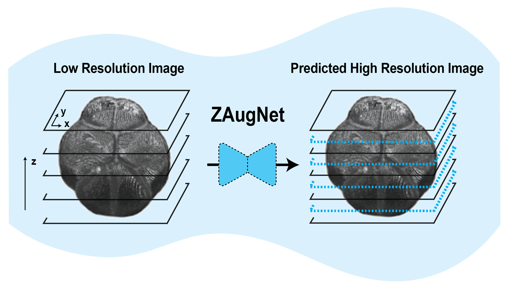
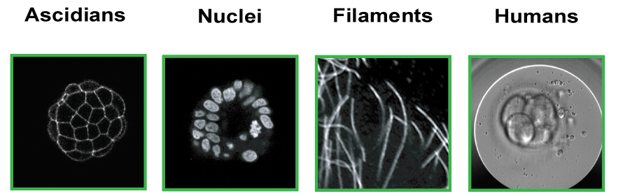
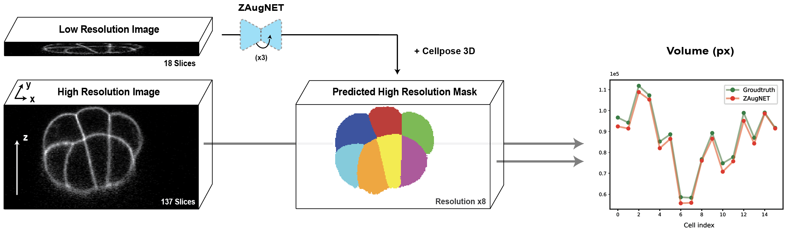
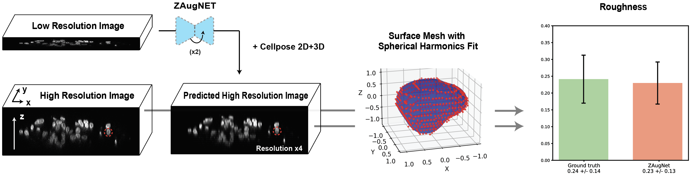
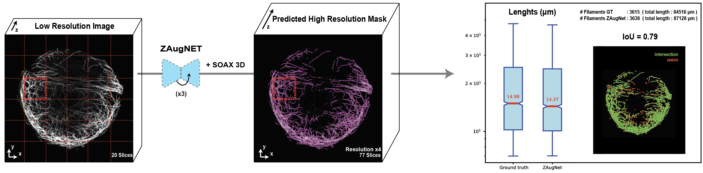

# Self-Supervised Z-Slice Augmentation for 3D Bio-Imaging via Knowledge Distillation

[**PAPER**](https://arxiv.org/abs/2503.04843) | [**COLAB**](zaugnet_colab.ipynb) | [**DATA**](https://doi.org/10.5281/zenodo.14961732)

**ZAugNet** is a fast, accurate, and self-supervised deep learning-based method designed to enhance z-resolution in biological images.<br>
It leverages a <em>GAN architecture</em> combined with <em>knowledge distillation</em> to maximize prediction speed without compromising accuracy. 

**ZAugNet** was developed by [Alessandro Pasqui](https://apasqui.github.io/) during his PhD at [Turlier Lab](https://www.turlierlab.com/), in collaboration with [Sajjad Mahdavi](https://www.linkedin.com/in/sajjad-mahdavi-4a3a48164/?originalSubdomain=fr), a research engineer in the same laboratory. The project is maintained by Hervé Turlier. For support, please open an issue. If you use **ZAugNet** in your work, please cite our [paper](https://arxiv.org/abs/2503.04843).

<br> <!-- Adds space before the image -->

<p align="center" style="margin-top: 20px;">
  
</p>

<br> <!-- Adds space before the image -->

The model is open-source and open-weight, allowing for easy integration and customization in your projects.

This repository includes the codebase, 4 ready-to-use pre-trained models, and a [Colab notebook](zaugnet_colab.ipynb) to train, fine-tune and run predictions with our network.

* [Introduction](#introduction)
* [Usage](#usage)
* [Data](#data)
* [Applications](#applications)
* [Citations](#cite)
* [License](#license)


## Introduction
Three-dimensional biological microscopy has significantly advanced our understanding of complex biological structures. However, limitations due to microscopy techniques, sample properties or phototoxicity often result in poor z-resolution, hindering accurate cellular measurements. Here, we introduce **ZAugNet**, a fast, accurate, and self-supervised deep learn- ing method for enhancing z-resolution in biological images. By performing nonlinear interpolation between consecutive slices, ZAugNet effectively doubles resolution with each iteration. Compared on several microscopy modalities and biological objects, it outperforms competing methods on most metrics. Our method leverages a generative adversarial network (GAN) architecture combined with knowledge distillation to maximize prediction speed without compromising accuracy. We also developed **ZAugNet+**, an extended version enabling continuous interpolation at arbitrary distances, making it particularly useful for datasets with nonuniform slice spacing. Both ZAugNet and ZAugNet+ provide high- performance, scalable z-slice augmentation solutions for large-scale 3D imaging. They are available as open-source frameworks in PyTorch, with an intuitive Colab notebook interface for easy access by the scientific community.

## Usage

### Colab Notebook
To train and run predictions with **ZAugNet** and **ZAugNet+**, you can use the [Colab notebook](zaugnet_colab.ipynb).

Download the Colab notebook and upload it on your [Google Drive account](https://drive.google.com/). 

The notebook provides detailed instructions on how to install and use our method for increasing the z-resolution of your own images. 

### Local installation
Download the repository and install dependences:
```shell
conda create -n zaugnet python=3.12.2
conda activate zaugnet
git clone https://github.com/VirtualEmbryo/ZAugNet.git
```
```shell
cd ./ZAugNet
pip install -r requirements.txt
```
(Optional) To download the pre-trained models:
```shell
curl "https://zenodo.org/records/14961732/files/zenodo.zip?download=1" --output ./zaugnet_data_and_models.zip
unzip ./zaugnet_data_and_models.zip -d ./zaugnet_data_and_models
mkdir ./data
mv ./zaugnet_data_and_models/zenodo/ascidians ./data/ascidians
mv ./zaugnet_data_and_models/zenodo/filaments ./data/filaments
mv ./zaugnet_data_and_models/zenodo/humans ./data/humans
mv ./zaugnet_data_and_models/zenodo/nuclei ./data/nuclei
mv ./zaugnet_data_and_models/zenodo/results ./results
```

* #### Predict with pre-trained models

Create a folder in <code>./ZAugNet/data/test</code> with the low-resolution images to be ZAugNet-augmented.

If needed, the default configuration hyper-parameters can be changed in <code>config.py</code>. Every hyper-parameter can also be passed directly with the execution command. 

To run a prediction with **ZAugNet**:
```shell
python predict.py --dataset='ascidians' --model_name='zaugnet'
```

To run a prediction with **ZAugNet+**:
```shell
python predict.py --dataset='ascidians' --model_name='zaugnet+'
```

The dataset options are: <code>'ascidians'</code>, <code>'nuclei'</code>, <code>'filaments'</code> and <code>'humans'</code>.


* #### Train with your own data

Create a folder in <code>./ZAugNet/data/train</code> with the high-resolution images to train your own ZAugNet or ZAugNet+ model.

If needed, the default configuration hyper-parameters can be changed in <code>config.py</code>. Every hyper-parameter can also be passed directly with the execution command. 

To train a **ZAugNet** model:
```shell
python train.py --dataset='<your_dataset_name>' --model_name='zaugnet'
```

To train a **ZAugNet+** model:
```shell
python train.py --dataset='<your_dataset_name>' --model_name='zaugnet+'
```

* #### Predict with your own model

Create a folder in <code>./ZAugNet/data/test</code> with the low-resolution images to be ZAugNet-augmented.

If needed, the default configuration hyper-parameters can be changed in <code>config.py</code>. Every hyper-parameter can also be passed directly with the execution command. 

To run a prediction with **ZAugNet**:
```shell
python predict.py --dataset='<your_dataset_name>' --model_name='zaugnet'
```

To run a prediction with **ZAugNet+**:
```shell
python predict.py --dataset='<your_dataset_name>' --model_name='zaugnet+'
```


## Data

All the data used for training our neural networks are freely available on [Zenodo](https://doi.org/10.5281/zenodo.14961732).<br>

In the Zenodo repository, you will find 4 datasets carefully selected to encompass diverse shapes, textures, and microscopy techniques. These datasets include:

* Ascidian embryos (fluorescence microscopy)
* Cell nuclei (fluorescence microscopy)
* Filaments of microtubules (fluorescence microscopy)
* Human embryos (transmitted light microscopy)

Additional information about these datasets can be found in the Methods section of our paper.

<br>
<p align="center">
  
  <br>
</br>

## Applications

<br>

* **Volume conservation** in ZAugNet-augmented 16-Cell stage ascidian embryo images:
<br>
<p align="center">
  
<br>
<br>

* **Roughness quantification** in ZAugNet-augmented cell nuclei images: 
<br>
<p align="center">
  
<br>
<br>

* **Lengths conservation** in ZAugNet-augmented microtubule filament images:
<br>
<p align="center">
  
<br>
<br>

## Citation

If you use this work, please cite:

```bibtex
@misc{pasqui2025selfsupervisedzsliceaugmentation3d,
      title={Self-Supervised Z-Slice Augmentation for 3D Bio-Imaging via Knowledge Distillation}, 
      author={Alessandro Pasqui and Sajjad Mahdavi and Benoit Vianay and Alexandra Colin and Alex McDougall and Rémi Dumollard and Yekaterina A. Miroshnikova and Elsa Labrune and Hervé Turlier},
      year={2025},
      eprint={2503.04843},
      archivePrefix={arXiv},
      primaryClass={cs.CV},
      url={https://arxiv.org/abs/2503.04843}, 
}
```

### License  

This work is licensed under a  
[Creative Commons Attribution-ShareAlike 4.0 International License](https://creativecommons.org/licenses/by-sa/4.0/).  

[](https://creativecommons.org/licenses/by-sa/4.0/)  


